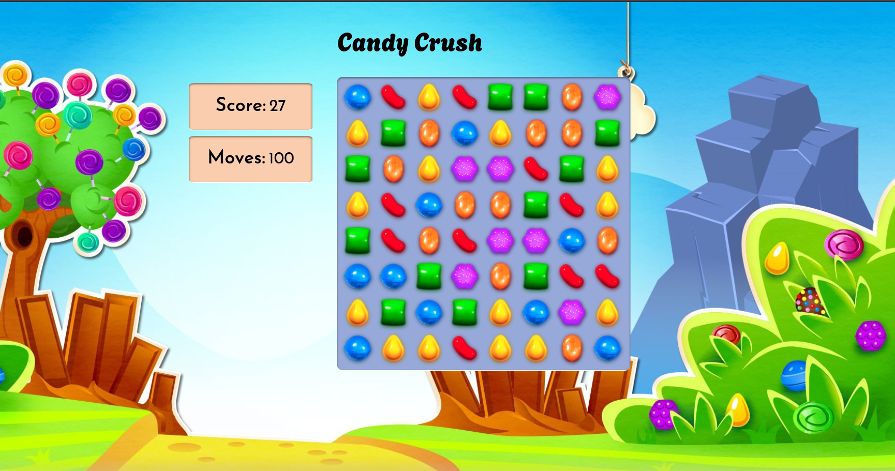

# Candy Crush

This is a Vanilla Javascript Game inspired By Candy Crush.

## Table of contents

- [Overview](#overview)
  - [Links](#links)
- [My process](#my-process)
  - [Built with](#built-with)
  - [What I learned](#what-i-learned)
  - [Useful resources](#useful-resources)
- [License](#license)

## Overview



Users should be able to:

- Drag and drop candies to create a match.
- Track their progress as they play the game.

### Links

- Live Site URL: [Add live site URL here](https://your-live-site-url.com)

## My process

To develop the Candy Crush inspired game, I initiated the workflow by generating square elements within a div container. Each square was then assigned a random background image. I employed drag events to enable the squares to be draggable and implemented checks to detect matching squares. When a match was found, the matched squares were removed. Additionally, I created a function for dropping candies and replenishing the grid with new ones.

### Built with

- Semantic HTML5 markup
- CSS custom properties
- Flexbox
- Vanilla Javascript
- ES6 Js

### What I learned

1. One of the game's features involves the interaction of dragging and dropping candies to form matches. To accomplish this, I learned how to initialize an element as a draggable entity.

```js
const square = document.createElement("div");
square.setAttribute("draggable", true);
```

Subsequently, used  events and it's different stages like , , , , , and , to move the candies.

```js
squares.forEach((square) => square.addEventListener("dragstart", dragStart));
squares.forEach((square) => square.addEventListener("dragend", dragEnd));
squares.forEach((square) => square.addEventListener("dragover", dragOver));
squares.forEach((square) => square.addEventListener("dragenter", dragEnter));
squares.forEach((square) => square.addEventListener("dragleave", dragLeave));
squares.forEach((square) => square.addEventListener("drop", dragDrop));
```

2. Developed proficiency using javascript inbuilt methods such as some(), every(), setInterval(), setAttribute(), createElement(), appendChild(), contains(), include(), forEach() demonstrating their versatile applicability across various projects.

### Useful resources

- [Build your own CANDY CRUSH using JavaScript, HTML and CSS | Ania Kubow](https://www.youtube.com/watch?v=XD5sZWxwJUk) - The tutorial by Ania Kubow helped understand the logic behind the game and how to use Vanilla Javascript to implement this logic.

## License

This project is licensed under the [MIT License](LICENSE). Feel free to use, modify, and distribute the code for your own space-related projects.
